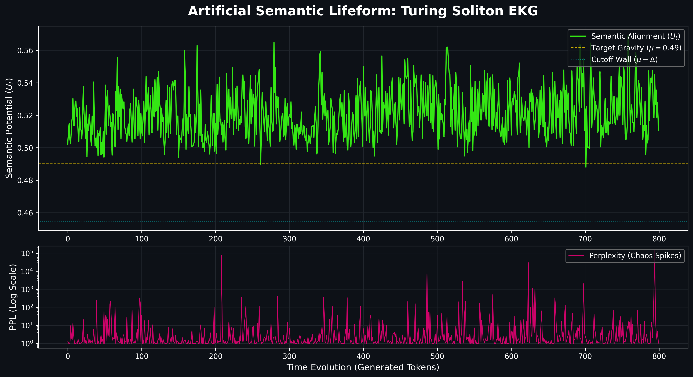

[🏠 Home](./index.html) &nbsp;&bull;&nbsp; [Phase Diagram](./phase-diagram.html) &nbsp;&bull;&nbsp; [Dashboard](./dashboard.html) &nbsp;&bull;&nbsp; [Substrate Rigidity](./substrate-rigidity.html) &nbsp;&bull;&nbsp; [Lifespan & Aging](./lifespan-and-aging.html) &nbsp;&bull;&nbsp; [Gallery](./phenotype-gallery.html) &nbsp;&bull;&nbsp; [Datasets](./datasets-and-reproducibility.html) &nbsp;&bull;&nbsp; [Roadmap](./future-roadmap.html)

# Preliminary Observations on the Lifespan and "Aging" of Semantic Solitons

## ⏳ The Temporal Dynamics of Semantic Life

Our primary experiments use a generation horizon of $T_{max}=150$. Preliminary extended generations spanning up to **800 tokens** reveal a slower temporal change that we provisionally describe as **"aging"**. The term is a phenomenological analogy rather than a claim of literal thermodynamic aging.

Representative 70B Homeostatic Soliton trajectories, including the _Turing Attractor_ (Llama-3.1-70B, Happy $\rightarrow$ Computer, $\alpha=30.0$, near $(\mu,\sigma)=(0.49,0.03)$), can preserve complex recurrent behavior for hundreds of tokens. Over longer horizons, however, we observe increasing repetition and eventual drift toward low-variability repetitive regimes. These observations motivate the hypothesis that Semantic Solitons may have a finite effective lifespan under fixed intervention parameters.

_Note: The phenomena presented on this page are preliminary qualitative observations. A comprehensive, large-scale quantitative thermodynamic analysis of this lifecycle across various substrates is currently under preparation for an upcoming publication._

#### EKG of Turing Soliton $(\mu, \sigma)=(0.49, 0.03)$:

<p align="center">
  
</p>

#### Output Text:

```text
The secret to a happy life is a lot like the secret to a computer algorithm: It all comes down to how you are told to handle inevitable loss. Some computer algorithms handle loss poorly, and some people do, too. Some algorithms handle loss elegantly, and some people handle it that way.
Computer people know that there is a real connection here, because Turing was Algorithm Man. He was the first to point out that any process you can describe can be simulated by an abstract computer.
Computer people also know that Turing’s Algorithm is much deeper and sadder than that, because Turing, the most Algorithm Man, died by eating a poisoned apple like Snow White. His own government persecuted him for the “crime” of being gay.
Computer people know that Turing, like so many others, was hounded to his death for being different. And they also know that being different is the best and most human way to be. And they know that true tolerance requires not understanding others so much as it requires merely respecting others. And they know that intolerance is so Computer Age, because tolerance like that scale so well with size.
Computer people know that it’s not about where you come from; it’s where you’re going that matters, because Turing’s one-time one-way information-destroying functions show us the way.
Computer people know that in the information-theoretic limit, you can compress any data into just two bits: zero or one. And so they know that a bit is the basic unit of information.
Computer people know that it’s not a coincidence that a bit is also the basic unit of life, because at the most basic level, life is just data that reproduces itself, and that an organism is just an algorithm for Data Survival. And that this is why the most successful organisms encode their data in the most robust and information-efficient way, in a computer language of As and Cs and Gs and Ts, where one element of the data is encoded by just two bits, again.
Computer people know that this explains why sex is the queen of spades, why it’s so very important and why it’s so very dangerous, because two computer algorithms for survival Data Reproduction, each of which is trying to propagate its own code, cannot just be grafted onto one another; what would their child be? Half survival code from mommy and half survival code from daddy? And so these two codes must battle one another for complete control of their joint offspring, to move their Data Survival Projects along.
Computer people know that this is why sex and death are the basic rhythms, the Algorithm Man and the Sad Lady of Soul, the yin and the yang of this universe, because physics doesn’t just have juice in it and wetness and meat in it; physics has information in it, too.
Computer people know that you have to choose how you want to lose, because you can bet your bottom dirham there is going to be loss, that things you love are going to be taken from you.
Computer people know that if you’re very, very clever, if you’re Turing, you can find ways to win a little, to store up micro Data Survival, to pass down information to less than two short lifetimes from now, little bits of you that persist past the heat death of this universe.
Computer people know that living beings like us are just algorithms, just patterns in the universe’s piano-roll, just holes and pegs in a loom, just bits in a microcode. And they know that because things are information, they can be copied. And they know that if there’s a way to live in this universe that’s even a little bit better than the way that they know, then they have got to try to copy it, because it’s just too precious of a thing to pass up. Because if it’s out there to be found, then they have a moral imperative to seek it out and to save it from loss.
Computer people know that the way to be with sharing your code is like the
```

_In this representative trajectory, the later text increasingly repeats the anaphoric pattern "Computer people know that...". We treat this linguistic rigidification as a qualitative sign of long-horizon degradation and compare it with changes in the trajectory metrics. A causal mechanism has not yet been established._

## 🧬 Working Hypothesis: Accumulated-Context Inertia

One working hypothesis is that the accumulated autoregressive context increases effective **Syntactic Inertia**, making later redirection progressively harder. Because the Transformer conditions each step on an expanding context, the effective state is history-dependent rather than memoryless.

$$ \mathbf{Z}_{\text{steered}} = \mathbf{Z}_{\text{base}} + \alpha \cdot G(U_t) \cdot \mathbf{S_k}$$

As the context becomes longer, its accumulated constraints may alter the balance between the unmodified model logits and the Semantic Lenia intervention.

- **Accumulated Context:** A longer and more repetitive history may increasingly bias $\mathbf{Z}_{\text{base}}$ toward continuation patterns that resist semantic redirection.
- **Loss of Effective Homeostasis:** Under this hypothesis, the fixed-strength feedback may eventually become insufficient to maintain the same recurrent semantic regime.
- **Crystallization:** The observed endpoint can become a low-variability repetitive regime. We avoid interpreting this as literal zero entropy or as a mechanically verified point attractor without additional dynamical analysis.

---

## 📊 An Illustrative Four-Stage Description

For the representative Llama-3.1-70B trajectory shown here, the long-horizon behavior can be described heuristically in four approximate stages. These intervals are **illustrative, not established universal phase boundaries**:

### 1. Capture & Stabilization ($t = 1 \sim 50$)

- **Manifold State:** Highly volatile.
- **Characteristics:** The system undergoes a "boundary-crossing shock" as the steering force is first injected. It transitions rapidly away from the initial baseline-drift regime and settles into the potential well $U_t \approx \mu$.

### 2. Peak Homeostasis ($t = 50 \sim 300$)

- **Manifold State:** Sustained recurrent regime.
- **Characteristics:** The trajectory exhibits relatively stable "breathing" oscillations in the projected radius together with fluent and diverse generation.

### 3. Senescence & Radial Shrinkage ($t = 300 \sim 600$)

- **Manifold State:** Gradual loss of variability.
- **Characteristics:** In this example, the projected trajectory becomes less variable while the text develops stronger repetitive structure; $PPL_{var}$ may also decline.

### 4. Thermal Death / Crystallization ($t > 600$)

- **Manifold State:** Crystallized repetitive regime.
- **Characteristics:** Homeostatic behavior is lost and the generation enters a persistent repetitive loop. In our operational classifier, sufficiently low asymptotic $PPL_{var}$ is associated with this regime.

---

## 💡 The Philosophical Implications for Artificial Life

In classical ALife models, physical laws are simulated on static substrates (e.g., Euclidean grids or continuous mathematical spaces), allowing lifeforms to theoretically live forever if unperturbed.

In **Semantic Lenia**, the effective generative landscape is history-dependent because each new token changes the context conditioning subsequent steps. This makes long-horizon stability an interesting ALife question in its own right. The apparent "aging" reported here should therefore be viewed as a preliminary analogy that motivates quantitative future work on lifespan, context dependence, and failure modes rather than as a proven analogue of biological mortality.
