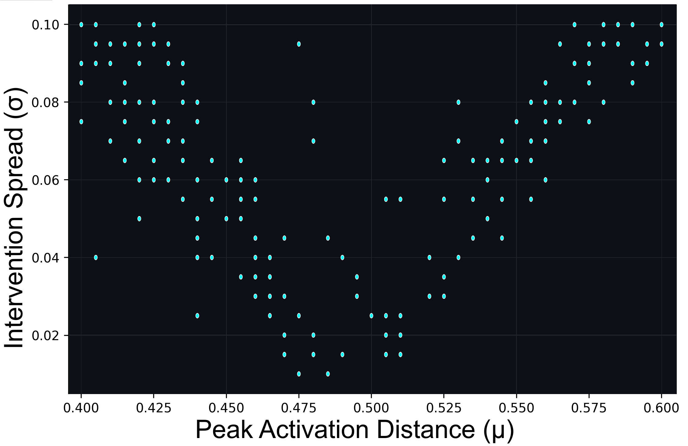

[🏠 Home](./index.html) &nbsp;&bull;&nbsp; [Phase Diagram](./phase-diagram.html) &nbsp;&bull;&nbsp; [Dashboard](./dashboard.html) &nbsp;&bull;&nbsp; [Substrate Rigidity](./substrate-rigidity.html) &nbsp;&bull;&nbsp; [Lifespan & Aging](./lifespan-and-aging.html) &nbsp;&bull;&nbsp; [Gallery](./phenotype-gallery.html) &nbsp;&bull;&nbsp; [Datasets](./datasets-and-reproducibility.html) &nbsp;&bull;&nbsp; [Roadmap](./future-roadmap.html)

# Phase Diagram & Taxonomy

To map the geometric landscape of machine cognition under non-linear steering, we perform high-resolution $(\mu, \sigma)$ parameter sweeps. This page explains the resulting phase diagrams and provides a mathematical taxonomy of the self-organizing trajectories.

---

## 🗺️ Macroscopic Interactive Phase Diagram

Under mild intervention strength ($\alpha=15$) on our exploratory substrate (**Meta-Llama-3.1-8B**), the measured trajectories exhibit a smooth, V-shaped **"Habitable Ridge"** in $(\mu,\sigma)$ space. Within this region, the state-dependent feedback supports bounded Homeostatic Soliton regimes over the observed generation horizon.
Here is the interactive phase diagram extracted from our grid sweeps of 779 individual simulation points:

<iframe src="./assets/heatmap_8b_a15.html" width="100%" height="1000px" style="border: 1px solid #e0e0e0; border-radius: 8px; box-shadow: 0 4px 6px rgba(0,0,0,0.1);"></iframe>

<a href="./assets/heatmap_8b_a15.html" target="_blank">↗️ Open Phase Diagram in Full Screen</a>

  
Figure 2-(Left): Emergent phenotype matrices mapping the spatial self-organization of trajectories for the Happy &rarr; Computer task under &alpha; = 15. Llama-3.1-8B illustrates high elastic habitability, featuring a structured band of stable Homeostatic Solitons (green) along the Habitable Ridge, bounded by Attractor Hijacks (blue).

---

## 🧬 Taxonomy of Emergent Phenotypes

To transition from qualitative evaluation to a rigorous, automated classification framework, we train a shallow decision tree classifier using trajectory-level metrics: **Mean Semantic Potential ($\bar{U}_t$)**, **Perplexity Variance ($PPL_{\text{var}}$)**, and **Step Count ($T$)**.

The **Perplexity Variance** is used here as an empirical measure of **token-level surprise variability** along a trajectory:

$$PPL_{\text{var}} = \frac{1}{T} \sum_{t=1}^T (PPL_t - \overline{PPL})^2 \quad (\text{Eq. 7})$$

In our classification dataset, $PPL_{\text{var}} < 10.0$ was empirically associated with low-variability repetitive trajectories. This threshold is an operational classifier boundary rather than a direct measurement of Shannon entropy.

- **Baseline Drift**: $\bar U_t < \mu-\Delta$, $PPL_{var} \geq 10.0$
- **Homeostatic Soliton**: $\mu-\Delta \leq \bar U_t \leq \mu+\Delta$, $PPL_{var} \geq 10.0$ (bounded recurrent / chaotic-like regime)
- **Abductive Leap**: Escape ($\bar U_t < \mu-\Delta $), $PPL_{var} \geq 10.0$ (slingshot-like transition into a third-party semantic domain)
- **Attractor Hijack**: $\bar U_t > \mu+\Delta $, $PPL_{var} \geq 10.0$ (Domain Collapse)
- **Semantic Crystallization**: asymptotically low $PPL_{var}$ with repetitive token looping (low-variability repetitive regime)
- **Syntactic Rupture**: Grammatical Rupture

## 🦋 Hardware-Level Reproducibility at the Edge of Chaos

Small numerical differences associated with NVIDIA Ampere (RTX 3090) and Blackwell (RTX Pro 4500) GPU architectures can lead to macroscopic token-sequence divergence under otherwise matched settings. Across the 779-point sweep, these hardware-sensitive divergences concentrate near the boundaries of the V-shaped **Habitable Ridge**. We interpret this spatial concentration as evidence of enhanced **perturbation sensitivity** in a critical regime, consistent with—but not by itself proving—an edge-of-chaos interpretation.

    
   
  
Figure 4: Spatial distribution of hardware-induced trajectory bifurcations (Llama-3.1-8B, Happy &rarr; Computer, &alpha; = 15.0). Each plotted point represents a parameter coordinate where infinitesimal FP16 rounding errors (10-4) between Blackwell and Ampere GPU architectures cause identical initial states to diverge into distinct text paths. The distribution closely follows the boundaries of the V-shaped ``Habitable Ridge'' mapped in Figure 2-(Left), with a visibly thicker divergence band along the left boundary (lower &mu;), consistent with the asymmetric structure of the intervention field.

