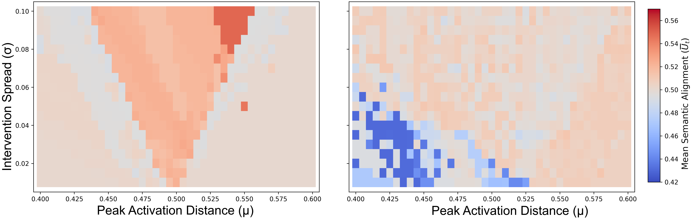
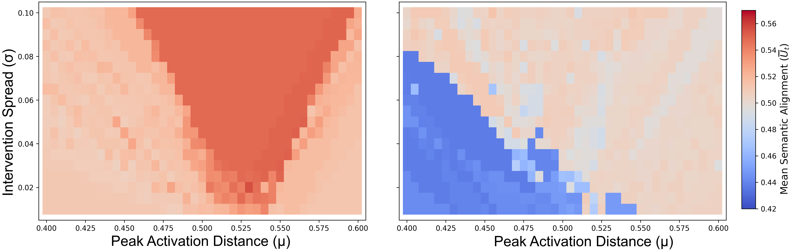
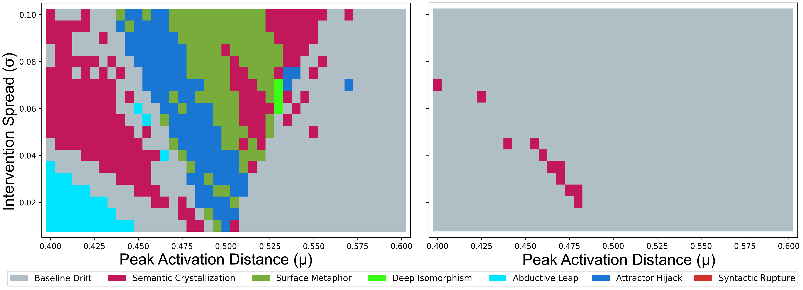

[🏠 Home](./index.html) &nbsp;&bull;&nbsp; [Phase Diagram](./phase-diagram.html) &nbsp;&bull;&nbsp; [Dashboard](./dashboard.html) &nbsp;&bull;&nbsp; [Substrate Rigidity](./substrate-rigidity.html) &nbsp;&bull;&nbsp; [Lifespan & Aging](./lifespan-and-aging.html) &nbsp;&bull;&nbsp; [Gallery](./phenotype-gallery.html) &nbsp;&bull;&nbsp; [Datasets](./datasets-and-reproducibility.html) &nbsp;&bull;&nbsp; [Roadmap](./future-roadmap.html)

# Substrate "DNA" and Material Rigidity

## 🔬 Substrate Phenomenology: Elasticity vs. Rigidity

In continuous Artificial Life, substrate properties strongly influence the morphology and viability of emergent structures. In **Semantic Lenia**, the host Large Language Model (LLM) plays an analogous role. Our experiments show markedly different responses to the same class of non-linear semantic intervention across model families. We use **Substrate "DNA"** and **Material Rigidity** as phenomenological terms for these substrate-dependent response patterns.

We compare **Llama-3.1-8B** and **Gemma-7B** as exploratory substrates to characterize these differences. The terms _elastic_ and _crystalline_ are descriptive metaphors for the observed intervention-response geometry rather than claims about literal material properties.

---

## 🛞 Llama-3.1-8B: The Elastic Rubber-like Manifold

**Llama-3.1-8B** behaves as a highly elastic, rubber-like manifold capable of smoothly deforming under external intervention without immediate structural collapse.

  
   
  <em>(a) Happy &rarr; Computer, &alpha;=15.0 </em>
    
    
   
  <em>(b) Brain &rarr; Symphony, &alpha;=30.0 </em>
   
  
Figure 1 Macroscopic phase diagrams of mean semantic potential (Ut) across exploratory substrates under varying task constraints. (a) presents the low-affinity Happy &rarr; Computer blend under mild coupling (&alpha; = 15.0), and (b) presents the high-affinity Brain &rarr; Symphony blend under increased coupling (&alpha; = 30.0). The left panels display Llama-3.1-8B exhibiting high manifold elasticity, forming a smooth, V-shaped ``Habitable Ridge'' of sustained potential. The right panels display Gemma-7B exhibiting rigid crystalline deflection at weaker intervention (a-right), with sharp structural breaches appearing only under stronger intervention (b-right).

- **Manifold Elasticity:** Under a mild coupling strength ($\alpha = 15.0$), Llama-8B yields smoothly, allowing the autoregressive trajectory to bend into a highly stable, continuous, V-shaped **Habitable Ridge** (as visualized in the macroscopic phase diagrams).
- **Response to Over-steering:** Under stronger intervention, Llama often transitions from the habitable regime into **Semantic Crystallization** (repetitive loops) rather than immediate syntactic disintegration.
- **Possible Contributing Factors:** Llama-3.1-8B has a vocabulary of roughly 128k tokens. Vocabulary size, tokenizer design, architecture, pre-training distribution, and other factors may all contribute to the observed flexibility; the present experiments do not isolate their individual causal effects.

---

## 💎 Gemma-7B: The Rigid Crystalline Substrate

In stark contrast, **Gemma-7B** behaves as an extremely rigid, brittle crystalline substrate. It actively resists external forces until its topological limits are breached, resulting in catastrophic failure.

  
   
  
Figure 2 Emergent phenotype matrices mapping the spatial self-organization of trajectories for the Happy &rarr; Computer task under &alpha; = 15.0. The left panel (Llama-3.1-8B) illustrates high elastic habitability, featuring a structured band of stable Homeostatic Solitons (green) along the Habitable Ridge, bounded by Attractor Hijacks (blue). The right panel (Gemma-7B) displays crystalline rigidity, where the external intervention force is completely deflected, leaving the system entirely within the unsteered baseline drift (gray).

- **The Inertial Barrier:** Under mild coupling ($\alpha = 15.0$), Gemma's rigid crystalline shell completely deflects the external semantic force. The steering trajectory is absorbed by the model's massive contextual gravity, remaining trapped in the baseline drift regime.
- **Abrupt Structural Fracture:** Gemma does not possess a smooth, plastic transition zone. If the intervention strength is increased to overcome this **Inertial Barrier**, the model resists up to a critical threshold, past which it abruptly fractures. This manifests phenomenologically as an immediate transition from baseline drift into complete **Syntactic Rupture** (the structural disintegration of natural language into garbled token streams like _"Data Data Data NN Data"_).
- **Possible Vocabulary Contribution:** Gemma-7B has a substantially larger vocabulary (~256k tokens). Vocabulary size may contribute to the observed response geometry, but this comparison is confounded by tokenizer design, architecture, training distribution, and other model-specific factors. We therefore treat vocabulary size as a hypothesis to be tested rather than as the established cause of rigidity.

---

## 📊 Mapping the Topological Contrast

Our 779-point grid sweeps capture this material dichotomy with high quantitative precision.

| Material Characteristic       | Meta-Llama-3.1-8B                 | Gemma-7B                               |
| :---------------------------- | :-------------------------------- | :------------------------------------- |
| **Substrate Type**            | Elastic (Rubber-like)             | Brittle (Crystalline)                  |
| **Vocabulary Size**           | ~128k tokens                      | ~256k tokens                           |
| **Habitable Ridge Geometry**  | Smooth, Continuous, V-shaped      | Highly Fragmented / Brittle Breaches   |
| **Response to Over-steering** | Gentle decay into Crystallization | Abrupt fracture into Syntactic Rupture |
| **Primary Steering Barrier**  | Weak semantic gravity             | High-inertia Crystalline Shield        |

These findings suggest that **Semantic Lenia** can also serve as a **dynamical probe** for characterizing substrate-dependent responses to non-linear semantic intervention. The observed contrasts motivate a broader investigation of how model architecture, tokenizer design, vocabulary, and training history shape the geometry and stability of homeostatic trajectory regimes.
